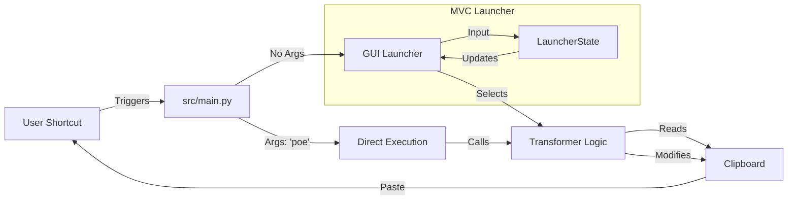

# Clip Tools

Headless, keyboard-driven clipboard transformation utilities for macOS.

---

## Vision

Streamline the workflow of moving text between applications (e.g., LLMs to Obsidian, CLI to Docs) by removing the friction of manual formatting. This project aims to be:

- **Invisible:** No persistent windows or docks. A "Spotlight-style" launcher appears only when needed and vanishes instantly.
- **Frictionless:** Zero-click workflows. Trigger with a global hotkey, select a tool, and paste.
- **Standardized:** Enforce consistent formatting rules (e.g., specific quoting styles for LLM chats) across all workflows.

---

## Architecture Overview

The system follows a **Dispatcher Pattern** coupled with a **Model-View-Controller (MVC)** GUI for the launcher.



### Core Components

| File | Purpose |
|------|---------|
| **`src/main.py`** | **The Dispatcher.** Handles CLI args or launches the GUI. Routes commands to the correct transformer. |
| **`src/gui.py`** | **The View.** A minimal Tkinter window. Handles rendering and keyboard events. |
| **`src/launcher_state.py`** | **The Controller/Model.** Manages search filtering, selection state, and "Safe Start" logic (preventing accidental execution). |
| **`src/transformers/`** | **Business Logic.** Pure functions that accept a string and return a transformed string. Decoupled from the UI. |

### Transformers

| Module | Purpose |
|--------|---------|
| `src/transformers/poe.py` | Converts Poe.com chat logs into Obsidian-friendly Markdown callouts (`> [!note]`). |
| `src/transformers/clean.py` | **(Beta)** "Smart Unwrapper" that fixes broken line breaks from PDFs while preserving paragraph structure. |

---

## Project Navigation & Context

This project uses a curated "manifest" approach to manage context for AI collaboration.

* **[`manifest.lst`](manifest.lst)**: **Start here.** The single source of truth for the project structure. It lists all relevant files and explains their purpose.
* **`make filesdump`**: Generates a complete, XML-wrapped context dump based on `manifest.lst`. Use this to seed new LLM sessions.

---

## Setup

### Requirements

- Python **3.11+**
- macOS (Required for the current GUI implementation and Automator integration)
- **Homebrew** (to install Tkinter)

### Installation

1. **System Dependencies (Critical):**
   Homebrew does not bundle Tkinter with Python by default. You **must** install it separately to run the GUI:
   ```bash
   brew install python-tk@3.13
   ```
   *(Note: Replace `@3.13` with your specific installed Python version if different).*

2. **Project Setup:**
   ```bash
   # Creates .venv, installs requirements (pyperclip, pytest), and installs project in editable mode
   make setup
   ```

---

## Makefile Targets

```bash
# Setup
make setup          # Install dependencies and project

# Testing
make test           # Run all tests (quiet mode)
make test-verbose   # Run tests with full output

# Execution
make makepoe        # Run the Poe transformer directly (CLI mode)

# Utilities
make clean          # Remove venv, caches, and tmp files
make showtree       # Display project structure
make filesdump      # Create context dump for LLMs
```

---

## Usage

### 1. Launcher Mode (The "Headless" Experience)
Run the launcher to search and select a tool interactively.
```bash
python -m src.main
```
* **Type** to filter the list (e.g., type "c" to find "Clean").
* **Arrow Keys** (Up/Down) to navigate the selection.
* **Enter** to run the selected tool on your clipboard content.
* **Escape** to close without action.

### 2. CLI Mode (Scripting/Automation)
Run a specific tool directly without the GUI. Useful for binding specific tools to specific hotkeys.
```bash
python -m src.main poe
```

### 3. Global Hotkey (Automator Integration)

To trigger the launcher from anywhere with a keyboard shortcut:

1. **Open Automator** → New → Quick Action
2. Set "Workflow receives" to `no input` in `any application`
3. Add "Run Shell Script" action containing:
   ```bash
   /path/to/clip-tools/run_launcher.sh
   ```
4. Save as "Clip Tools Launcher"
5. **System Settings** → Keyboard → Keyboard Shortcuts → Services → Assign your preferred shortcut

The `run_launcher.sh` script is self-locating (no hardcoded paths required).

---

## Current Status

| Feature | Status | Note |
|---|---|---|
| **Project Scaffolding** | ✅ | Makefile, venv, TDD setup |
| **Poe Transformer** | ✅ | Stable, fully tested |
| **GUI Launcher** | ✅ | Searchable Listbox, Arrow Nav, MVC Architecture |
| **Automator Integration** | ✅ | Global hotkey via Quick Action |
| **Smart Unwrapper** | ⚠️ | Beta. Regex needs refinement for code-block edge cases. |
| **Error Formatter** | ⏳ | Planned (See Goals.md) |

> **Note:** For future plans and edge-case tracking, please refer to [`Goals.md`](Goals.md) and [`TODO.md`](TODO.md).
